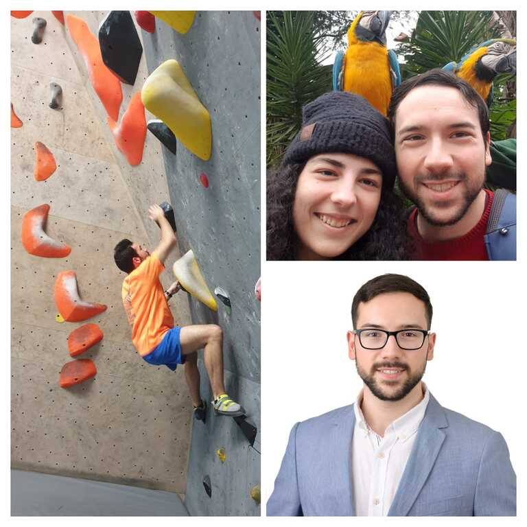

# Pedro Águas Marques Resume   

## Summary

[pedromar2010@gmail.com](mailto:pedromar2010@gmail.com)

I am a recent master's graduate in Computer Engineering from Instituto Superior Técnico at the University of Lisbon. However, while studying, I gained 2+ years of experience working in IT at companies such as Vodafone, where I participated in data projects.

I began working at the age of 16 as a full-stack developer at a startup company for a period of six months.

When I was 17, I created a freelance full-stack project where I implemented a fully functional desktop movie theater  and conducted interviews with the movie theater owner.

At the age of 18, I participated in a team programming contest.

At 19, I worked as a counter person for a non-profit organization and worked as coordinator for the student commission.

When I turned 20, I completed a summer internship at Vodafone, where I built their next-generation micro-services architecture that is still in use today.

At 21, I worked for over a year as a Data Scientist at a multinational American company. In this role, I served as the lead developer, designing and implementing a new deep learning recommendation system/model for the company.

Now, at 23, I am working at another multinational American company where I develop and automate multiple pipelines in Scala, resulting in an annual cost savings of 100k by eliminating manual processes.

I have a passion for technology, learning new things, and running. At 22 until the present, I joined a running team with workouts every week and completed multiple mini marathons. I am also skilled in climbing, swimming, cycling, canoeing and playing tennis.

I am currently seeking new opportunities, preferably in the field of Data or Software Engineering, where I believe I can provide the most value. However, I am also open to other opportunities.

“What I don’t know, I will learn”

## Highlights
- Certification on Scala 
- Python, Scala, SQL, terraform, JavaScript, Java
- AWS EMR, S3 and many more
- Spark, Airflow, Snowflake, Docker, GitHub
- D3.js, NodeJS, Pytorch, scikit-learn
- MLFlow, Tableau, Plotly
- multiple certifications from DeepLearning.AI Deep Learning specialization 

## Testimonials

### Pavel Calado

_Pedro is a dedicated worker and an excellent team member, not only promptly carrying out the needed tasks as also actively cooperating with the remaining team members. In addition, Pedro has shown himself resourceful and inventive. These characteristics, together with a firm dedication to his work, allowed him to implement and test all suggestions, while also taking his own decisions and defending their outcomes. At a personal level, Pedro is a communicative person, who gets along very well with all those he has worked with. From what I could observe, he is well respected by both his colleagues and his teachers._

[Full letter of recommendation from Pavel](docs/pedro_marques_2022.pdf)

### Kassem Hussein

_During the time I worked with Pedro he was involved in 2 projects, one for automating DAGs in a Machine learning model and another for exploring new techniques to detecting anomalies. In both projects Pedro performed with great excellence and minimal supervision._

## Experience

### Data Engineer - [https://www.carpe.io/](https://www.carpe.io/), PT
#### November 2022 - Present
Carpe Data leverages social media, online content, and other forms of alternative data to gain a deeper insight into the risk of insuring companies and individuals.
- Automated multiple data pipelines with over 50TB of data and over 70 steps using Airflow, which ran in parallel. This automation saved the company money, as manual queuing of each step on AWS was no longer necessary.
- Architected and implemented a scalable 10TB data pipeline orchestration system.
- Built new data pipeline steps and respective integration and unit tests in Scala to integrate new data sources into a 40TB pipeline.

    Airflow, Python, AWS EMR and Github.

### Data Scientist - [https://gympass.com/](https://gympass.com/), PT
#### August 2021 - November 2022
Prototyped a geospatial deep learning recommendation system for Gympass using an unsupervised machine learning GNN architecture, aiming to replace the current extremely limited 3rd-party recommendation system.
- Built, trained, and evaluated an unsupervised machine learning algorithm (Graph Neural Network) on AWS.
- Tracked model experiment metrics using MLFlow.
- Extracted, cleaned, scaled, and encoded geospatial production data for the system with a PySpark data pipeline (NLP).
- Analyzed data on a 170TB SQL PrestoDB database to facilitate data-driven decision-making.
- Built and deployed a Docker image server.

### Backend Developer - [https://www.vodafone.com/](https://www.vodafone.com/), PT
#### July 2020 - September 2020
Built a production REST API, with about 270 requests on average per second, for consumer promotions to replace legacy version on a large scale enterprise EDW with NodeJS + Express + Oracle DB and Jira for task management.

### Software Engineer - [https://forecastit.pt/](https://forecastit.pt/), PT
#### April 2017 - September 2017
Model Information Systems with (ER) Diagram using Oracle SQL Developer Data Modeler for experimenting

## Working in a Large Scale Scrum team
- Two weeks sprints
- Sprint reviews with stakeholders at the end of the sprint
- Retrospective after each sprint